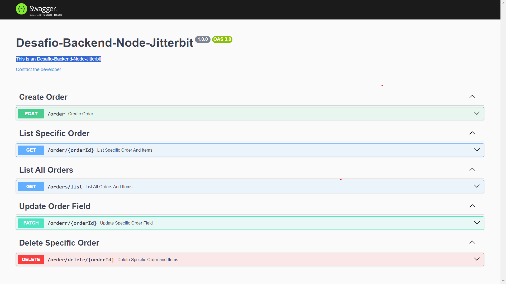

### Desafio Backend Nodejs Jitterbit

## 🚀 **Tecnologias**

- Nodejs
- Express
- PrismaORM
- Swagger API
- BD Sqlite

### 💻 Projeto

- Neste Desafio foi proposto construir uma API em Nodejs com 5 end-points, sendo eles: 

##### `Post` para criar um pedido.
##### `Get` para listar um pedido.
##### `Patch` para atualizar um campo de um pedido.
##### `Delete` para deletar um pedido.
##### `Get` para listar todos os pedidos.

## 🚀 Como executar a Aplicação

### Rotas da aplicação

#### CreateOrder.routes: Post - `/order`.

- A rota deve receber `orderId`, `value`, `productId`, `quantyti` e `price` dentro do corpo da requisição. Ao cadastrar um novo pedido, ele deve ser armazenado dentro de um objeto `json` no seguinte formato:

Obs: (O campo `creationDate`, é gerado automaticamente pelo PrismaORM).

[
	{
		"orderId": "v10089015vdb-01",
		"value": 10000,
		"creationDate": "2023-09-03T19:33:48.973Z",
		"Items": [
			{
				"orderId": "v10089015vdb-01",
				"productId": 2434,
				"quantity": 1,
				"price": 1000
			}
		]
	}
]

#### ListOrderById.routes: Get - `/order/:orderId`.

-A rota deve receber pelo cabeçario/url de requisição `http` o `orderId` do pedido a listado.

#### ListAllOrders.routes: Get - `/orders/list`.

#### UpdateOrderField.routes/: Patch - `/orderr/:orderId`.

- A rota deve receber pelo cabeçario/url de requisição `http` o `orderId` do pedido a ser atualizado, e pelo corpo da requisição o `value` no formato de um objeto `json`, propriedade a ser atualizada no pedido , essa atualização só pode acontecer caso o parâmetros `orderId` seja válidado.

#### DeleteOrderById.routes: Delete - `/order/delete/:orderId`.

- A rota deve receber pelo cabeçario de requisição `http` o `orderId` do pedido a ser deletado.

## Para rodar essa aplicação siga os seguintes passos:

- Copie a url do repositório na aba `CODE`.
- Com o git instalado, execute o seguinte comando => `git clone "Aqui vai a url copiada acima"`.
- Com o `Nodejs` e o `Yarn ou Npm` instalados, Na sua IDE preferida, abra o terminal do `git`, e execute o seguinte comando => `yarn ou npm i`, para baixar as dependências da aplicação.
- Para rodar o projeto execute o seguinte comando => `yarn dev ou Npm dev`.
- Para testar o funcional da aplicação será necessário o uso das ferramentas `Insomnia ou Postman` e criar as rotas da aplicação citadas acima.

## Para rodar a ferramenta de Interface de visualização do `Banco de Dados do Prisma`.

- Com a aplicação já startada .... abra uma 2 guia/aba do seu terminal e digite `npx prisma studio`.

## Para rodar a Documentação da Aplicação

- Com a aplicação já startada ... No seu navegador de internet digite => http://localhost:3000/api-doc